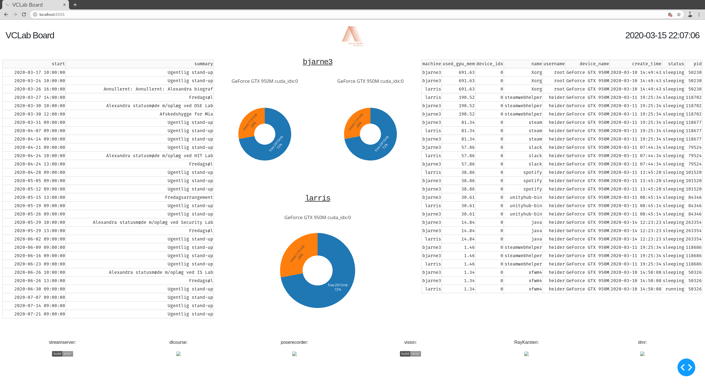

<!---->

  

<h1 align="center">Heimdallr</h1>

<!--# Heimdallr-->

A package for live plotting lab relevant information directly in your browser

  
  

 

## Demo

## Usage

- Setup MQTT broker connection information heimdallr mqtt_token
- On computation machines run the publisher service. heimdallr publish
- Run server service on the displaying machine. heimdallr serve
